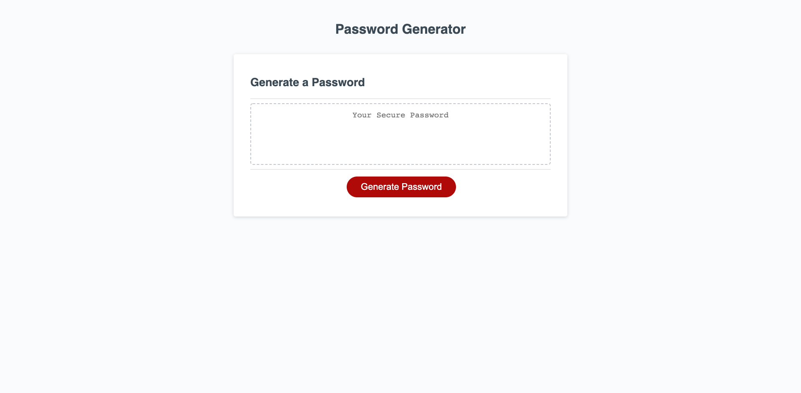

# Random Password Generator

## Description

This application generates a random password to improve security for sensitive data. The motivation behind this project was create 
a password generator to help improve security. Random passwords are much safer than something used frequently. This project was a great 
expericance to work with different methods and learn new techniques.

## Installation

The application can be downloaded through the repository or accessed through the link below.

[PasswordGenerator](https://nhilde.github.io/PasswordGenerator/)

## Usage

Simply click the button and answer the following prompts, and a random password with the selected criteria will be generated and prompted.

## License

Licensed under the [MIT License](LICENSE)